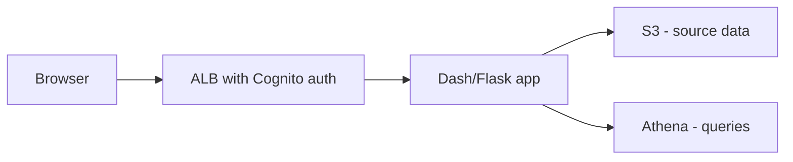

# README Review Standards

Target: {repository} / PR #{pr_number}

This document defines README standards for gds-idea projects. It serves as both
a human-readable reference and the automated reviewer's criteria. It is scoped
to `README` files only — Python docstrings, MkDocs/website documentation, and
other doc types are handled by their own dedicated reviewers.

**Scope:** `README.md`, `README.rst`, and any nested `README.*` at the root of a
package or subdirectory (e.g. `lambda/webhook_receiver/README.md`,
`app_src/README.md`).

**Out of scope:** Python docstrings, `docs/**` and MkDocs sites (`mkdocs.yml`),
`CONTRIBUTING.md`/`CODE_OF_CONDUCT.md`/`SECURITY.md` (review only if changed in
the PR, and only against the Structure and Clarity sections — they are not
READMEs), `CHANGELOG.md`, auto-generated docs, `LICENCE`/`LICENSE` files
themselves.

**How to review:** Work from the PR diff you already have from the code review.
Only review a README if it was added or modified in this PR, **or** if the PR
changes behaviour that an existing README documents (see Section 6). Judge each
file against its purpose — a subfolder README for a single Lambda does not need
the full top-level structure. Never invent gaps to fill a quota; flag only what
would genuinely confuse or slow down a developer.

## 1. Structure and Completeness

### Cover the sections a reader needs to get started

- A top-level `README.md` should give a reader enough to understand the project
  and run it. The following are expected for almost any runnable project:
  - **Project title and one-line description** — what this is and what problem
    it solves, in plain English.
  - **Prerequisites** — runtime versions, AWS access, accounts, tools required
    before starting.
  - **Installation / setup** — how to install dependencies and get to a working
    state.
  - **Usage** — how to actually run the thing, with working commands. This
    covers both running the app and a contributor's local workflow (tests,
    linting, pre-commit hooks) as one section — treat these as the same
    concern, not two.
  - **Configuration** — where configuration lives (e.g. `config.py`). If the config is large or complex enough to need explanation, that is a good reason for a subfolder README (see below).
  - **Architecture overview** — how the project is built and, for anything
    that reads from or writes to AWS resources, which ones (see Section 2).
- The following apply where the repo's purpose calls for them, but are not
  expected on every README:
  - **External dependencies** — see Section 2.
  - **Repository structure** — see Section 2.
  - **Testing** — how to run the test suite, if this is not already covered
    under Usage.
  - **Troubleshooting** — known setup/runtime gotchas (see Section 5).
- Not every README needs every section. A single-Lambda subfolder README may
  only need a description, its inputs/outputs, the AWS resources it reads from
  or writes to, and how to build it. Judge by the file's role, not a checklist.
- The rationale: a README is the first thing a new joiner or external team
  reads. Missing setup or usage information is the most common reason someone
  cannot run a repo they have just cloned.

**Flag when:** a top-level README for a runnable project has no way to install,
run, or configure it — a reader would be stuck after cloning.

**Do not flag when:** a purpose-specific file (e.g. a Lambda subfolder README)
legitimately omits sections that do not apply to it.

### Order sections so a first-time reader can follow them top to bottom

- Sections should flow in the order a reader needs them: what it is →
  prerequisites → install → usage (including local/dev workflow) →
  configuration → architecture.
- A reader should not have to scroll to the bottom for prerequisites they needed
  before the install step at the top.

### Know when a subfolder README is needed

- A subfolder README (e.g. `lambda/webhook_receiver/README.md`) is warranted
  when either is true:
  - The top-level README should stay focused on getting a reader started and
    documenting key top-level configuration — it should not absorb every
    component's detail.
  - The component has enough of its own configuration, modules, or moving
    parts (e.g. a Lambda with several config files or a non-trivial internal
    structure) that folding it into the top-level README would either bloat
    that file or bury the detail a reader of that component actually needs.
- At minimum, a subfolder README should cover: a short description of the
  component's role, its inputs/outputs, the AWS resources it reads from or
  writes to, how to build/deploy it, and a brief rundown of any configs it
  uses and what each controls.
- Judge by the component's role, not a fixed checklist — a trivial subfolder
  does not need its own README at all if the top-level README (or the code
  itself) already documents it adequately.

## 2. Project Architecture

### Show how the pieces fit together with an architecture or workflow diagram

- If the repo has more than one component or service (e.g. a web app plus a
  scheduled Lambda plus infrastructure, or multiple stacks that call each
  other), the README should show how they relate — including which AWS
  resources the app reads from or writes to. Prefer a **Mermaid diagram** in a
  fenced ` ```mermaid ` code block over a linked image or an external doc — it
  renders natively on GitHub, stays in the repo as reviewable text, and shows
  up in diffs when the architecture changes. A clear prose description of the
  relationships is an acceptable alternative for simpler cases.

**Bad — architecture diagram lives only in an external Confluence page:**
```markdown
## Architecture
See our Confluence page for the architecture diagram.
```

**Good — a Mermaid diagram kept in the repo, reviewable in the diff:**
`````markdown
## Architecture


`````

**Flag when:** a repo with multiple components/services has no architecture
overview at all and a reader cannot tell how the pieces relate from the README.

**Do not flag when:** a single-service or single-purpose repo has no diagram —
the existing prose already covers the same ground.

### Name external dependencies the code clearly relies on

- A reader auditing or extending the app needs to know what it talks to beyond
  gds-idea's own systems — third-party APIs and services we don't control
  (e.g. Tavily, a departmental API, Airtable) — and briefly what each is for.
- This does not include AWS or other internal gds-idea systems. Those belong
  in the architecture diagram above, not a separate list: a new joiner already
  knows the team builds on AWS, and duplicating that here just adds another
  place for the description to drift from the diagram.

**Bad — the app clearly calls an external API but the README never says so:**
```python
# The code calls out to a third-party service...
response = requests.get(f"https://api.example-provider.com/v1/lookup/{{ref}}")
```
```markdown
<!-- ...but the README has no mention of example-provider.com anywhere -->
```

**Good — the dependency is named and its purpose is explained:**
```markdown
## External Dependencies
- **Example Provider API** — used to validate case references before
  submission. Requires an API key set via `EXAMPLE_PROVIDER_API_KEY`.
```

**Flag when:** the code clearly calls an external API/service that the README
never mentions.

**Do not flag when:** every external call the code makes is already named in
the README, even briefly, or the "dependency" is actually an internal AWS
resource already covered by the architecture diagram.

### Give non-trivial repos a repository structure overview

- For a repo with more than a handful of top-level directories, a short fenced
  tree of the key folders (what lives where) saves a reader from having to
  explore blindly.

**Good — a repository structure overview:**
`````markdown
## Repository Structure

```text
app_src/
  dash_app.py       # Entry point, routing, auth
  callbacks/        # Callback wiring per page
  dashboards/       # Page layouts
  utils/            # Pure helper functions
lambda/
  data_refresh/     # Scheduled data-refresh function
```
`````

**Flag when:** a repository-structure overview exists but no longer matches
the actual layout.

**Do not flag when:** a single-purpose repo or small subfolder has no folder
tree — the existing prose already conveys the same information.

Scale all three of the above to the repo: a single-purpose repo or a small
subfolder README does not need an architecture diagram, an external
dependencies list, or a repository structure overview if the existing
description already conveys the same information.

## 3. Accuracy Against Code

**This is the most important check.** A README that is confidently wrong is worse
than one that is missing — it sends readers down the wrong path.

Verify every factual claim against the actual repo and this PR's diff:

- Do code snippets match real function signatures, class names, and imports in
  the repo?
- Are package and dependency versions consistent with `pyproject.toml` /
  `requirements.txt`?
- Are CLI commands, subcommands, and flags accurate and currently supported?
- Are environment variable names spelled exactly as the code reads them?
- Are file paths, directory names, and module paths correct?
- Are API endpoints, routes, and URLs correct?
- Are AWS resource references (bucket names, function names, account/region
  conventions) consistent with the CDK config?

**Bad — example drifts from the code it documents:**
```python
# README says:
from mypackage import run_review

# But the code was renamed in this PR to:
from mypackage import run_readme_review
```

**Good — snippet matches the current public API and is runnable as written:**
```python
from mypackage import run_readme_review

run_readme_review(repository="co-cddo/my-project", pr_number=42)
```

### Check env var and command names character-for-character

- Environment variable names and CLI flags must match the code exactly,
  including case and separators (`GITHUB_TOKEN` vs `GITHUB_API_TOKEN`,
  `--dry-run` vs `--dryrun`).
- A near-miss is harder to debug than an obvious omission, because the reader
  assumes the docs are right and looks everywhere else first.

## 4. Installation, Prerequisites and Getting Started

### Give a clean, copy-pasteable setup path

- Setup steps should be runnable commands, not prose descriptions of what to do.
- State prerequisites (Python version, `uv`/`pip`, Node, Docker, AWS profile)
  before the first install command that assumes them.
- If the repo uses `gds-idea-app-kit` or a shared template, point to the shared
  setup rather than duplicating and letting it drift.

**Bad — vague, non-runnable, hidden assumptions:**
```markdown
Install the dependencies and set up your environment, then run the app.
```

**Good — explicit prerequisites and copy-pasteable commands:**
`````markdown
## Prerequisites
- Python 3.12+
- `uv` installed
- AWS SSO profile `gds-idea-dev` configured

## Setup
```bash
uv sync
uv run pytest        # verify the environment
```
`````

### Document the devcontainer launch steps in full, if the repo uses one

- If the repo contains a `.devcontainer/` folder (or otherwise expects
  development inside a devcontainer), the README **must** spell out the exact
  ordered steps required to get the container running — not just "open in a
  devcontainer".
- This is the single most common gap across gds-idea repos: the container
  configuration exists, but the surrounding host-side steps are assumed
  knowledge. A new joiner cannot infer these, and they fail silently with
  unhelpful errors (missing Docker socket, expired credentials,
  `NoCredentialProviders`).
- The steps must be runnable commands in the order a reader executes them, and
  must cover, where relevant:
  - **Selecting the AWS credentials** the container will use, and completing
    any role assumption the shared tooling requires. Use a placeholder rather
    than naming real profiles or roles — which profiles exist is not
    something a README should be publishing — and point to the shared
    tooling (e.g. `idea-app provide-role`) rather than re-explaining role
    assumption/MFA mechanics that live in another repo and can drift out of
    sync with this one.
  - **Launching the devcontainer** itself (VS Code "Reopen in Container", or
    the CLI equivalent).
- Do not use the README to re-teach baseline environment setup (e.g. that a
  container runtime needs to be running) that is already covered by the
  team's standard onboarding — assume a new joiner has been through it.

**Bad — assumes all the host-side setup:**
```markdown
## Development
Open the project in VS Code and reopen in the devcontainer.
```

**Good — the ordered, copy-pasteable sequence, without hard-coding
environment-specific names:**
`````markdown
## Running in a devcontainer

1. Select the AWS profile the container should use (see team onboarding for
   available profiles) and assume the role:
   ```bash
   export AWS_PROFILE=<your-profile>
   idea-app provide-role
   ```
2. Launch the devcontainer: in VS Code, run
   **Dev Containers: Reopen in Container** (or `devcontainer up` from the CLI).
`````

## 5. Troubleshooting

### Capture known, recurring gotchas — don't just document the happy path

- If the repo has a known, recurring setup or runtime issue (devcontainer
  credential/socket errors, a flaky external dependency, a common
  misconfiguration), a Troubleshooting section should capture it as a
  symptom → fix pair, not just leave it to be rediscovered by every new joiner.
  This is the natural home for the devcontainer failure modes named in
  Section 4 (missing Docker socket, expired credentials,
  `NoCredentialProviders`) when they recur often enough to be "known".
- **Never invent a Troubleshooting section from nothing.** Only flag a gap here
  when a known recurring issue is actually evident — from the PR description,
  linked issues, comments, or an existing-but-incomplete Troubleshooting
  section — not by default the way Installation/Usage are checked. An absent
  Troubleshooting section is not itself a defect; a *known* gotcha that stays
  undocumented is.
- If an existing Troubleshooting section documents an issue this PR fixes, it
  should be removed or updated in the same PR — a stale troubleshooting entry
  for a bug that no longer exists is as misleading as a stale code example.

**Bad — a known recurring issue is referenced in the PR but never written down:**
```markdown
<!-- PR description mentions: "Fixes the third report of devcontainer builds
     failing with 'no such file' on first run — needs a rebuild without cache" -->
<!-- README has no Troubleshooting section at all -->
```

**Good — the known gotcha is captured as symptom → fix:**
`````markdown
## Troubleshooting

**Devcontainer fails on first build with "no such file":**
Rebuild without the Docker layer cache:
```bash
devcontainer build --no-cache
```
`````

**Flag when:** a known, recurring issue is evident from the PR/repo context but
not captured anywhere in the README.

**Do not flag when:** the repo has no known recurring issues yet — do not
invent a Troubleshooting section just to fill the checklist.

## 6. Keeping Documentation in Step with the Code

### Update the README when this PR changes behaviour it documents

- If the PR adds or changes a CLI command, flag, environment variable, API
  endpoint, config option, or public function that the README documents, the
  README must be updated in the same PR.
- Judge whether a README is "maintained" by whether its content still matches
  the current codebase (see Section 3), not by any freshness metadata —
  outdated content, not outdated metadata, is the defect.

**Flag when:** the diff adds a new `--dry-run` flag (or new env var, endpoint,
etc.) but the Usage/Configuration section is untouched.

### Flag placeholder and unresolved content

- Placeholder text (`TBA`, `TODO`, `FIXME`, `changeme`, `Lorem ipsum`,
  `<your-value-here>`, "coming soon") must be resolved before merging, or
  explicitly marked as a tracked follow-up.
- Empty or stub sections with a heading and no content should either be filled
  or removed.

## 7. Clarity, Formatting and Style

### Keep the writing clear, and the formatting consistent

- Writing should be concise and in plain English; explain or link acronyms and
  project-specific terms on first use (GATS, GAS, CDK, MCP, etc.).
- Heading levels should nest properly (no jumping `#` → `###`), and there should
  be a single top-level `#` title.
- Lists, tables, and emphasis should be used consistently, not mixed ad hoc.
- Use UK English spelling (licence, behaviour, organisation) to match the rest
  of the estate.

### Fence code blocks and tag them with a language

- Every code block must be fenced (triple backticks), never indented-only, and
  must carry a language identifier (` ```bash `, ` ```python `, ` ```json `).
- The language tag drives syntax highlighting and signals to the reader what
  they are looking at.

**Bad — no language tag, so no highlighting and ambiguous intent:**
````markdown
```
uv sync
uv run pytest
```
````

**Good — tagged as shell:**
````markdown
```bash
uv sync
uv run pytest
```
````

### Format links correctly and keep them alive

- Links must use proper Markdown syntax `[text](url)`, not bare or broken
  references, and relative links to repo files must resolve.
- Anchor links (`#section-name`) must match a real heading.

## 8. Comment Prefixes

Use a single prefix per comment so the author can triage quickly:

- **Docs:** — Missing or incorrect information that would confuse or mislead a
  reader (wrong example, undocumented new flag, broken setup step).
- **Suggestion:** — A change that would improve readability or completeness but
  is not strictly wrong.
- **Nit:** — Minor formatting or style issue (missing language tag, heading
  jump, inconsistent list style).

## 9. Anti-Patterns to Flag

- **Code examples that do not match the current code** (renamed functions,
  changed signatures, removed flags)
- **Environment variable or CLI flag names that differ from the code**
- **New behaviour in the PR with no corresponding README update** (new flag,
  env var, endpoint, or config option)
- **Placeholder content shipped to main** (`TBA`, `TODO`, `changeme`,
  `<your-value-here>`, "coming soon")
- **Unfenced code blocks, or fenced blocks with no language identifier**
- **Broken links or anchors** (dead relative paths, `#section` with no matching
  heading)
- **Non-runnable setup instructions** (prose where commands are needed, or
  hidden prerequisites)
- **A `.devcontainer/` in the repo but no documented launch steps** — or steps
  that jump straight to "reopen in container" without covering credential or
  role setup
- **A multi-component/multi-service repo with no architecture overview at all**
  — a reader cannot tell how the pieces relate
- **A clear external dependency/integration used by the code with no mention
  in the README**
- **A known, recurring issue evident from the PR/repo context left out of a
  Troubleshooting section** (or an existing entry left stale after the PR fixes it)
- **Incorrect file paths or directory structure** that no longer matches the repo
- **A repository-structure overview that no longer matches the actual layout**
- **Duplicated content that will drift** (setup steps copy-pasted instead of
  linking the shared source)
- **Heading-level jumps or multiple top-level `#` titles**
- **Unresolved merge conflict markers** (`<<<<<<<`, `=======`, `>>>>>>>`)

## 10. Do NOT Flag

- Stylistic phrasing choices that are clear and correct but not how you would
  personally word them
- Missing sections that genuinely do not apply to a purpose-specific file (e.g.
  no "Installation" in a single-Lambda subfolder README)
- Prose spelling/grammar already handled by a linter or spell-checker, unless it
  changes meaning
- American vs British spelling in third-party quoted text or external tool names
- The absence of badges, logos, or a table of contents (nice-to-have, not
  required)
- The absence of an architecture diagram or folder-structure overview in a
  small, single-purpose repo where the existing prose already conveys the
  same information
- A missing Troubleshooting section when the repo has no known recurring
  issues — do not invent one to fill the checklist
- A good README that could be marginally better — one **Suggestion:** is enough;
  do not nitpick every sentence
- Auto-generated README content produced by a template or tool
- If there are no README files added or modified in the PR (and no documented
  behaviour was changed), report that the README review found nothing to flag —
  that is a valid, expected outcome
